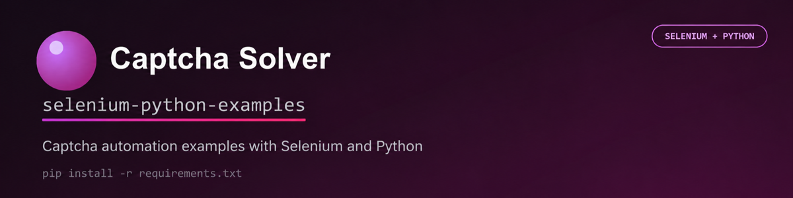

# Captcha solving examples with Python and SeleniumBase

Ready-to-run browser automation examples for the official
[`captcha-solver-api`](https://pypi.org/project/captcha-solver-api/) Python SDK.
They show how to detect captcha parameters on a live page, create the correct API
task, receive a solution, and apply it in a Selenium browser session.

The repository includes reCAPTCHA v2 and v3, callback-based reCAPTCHA,
Cloudflare Turnstile and Challenge pages, image recognition, coordinate captchas,
and proxy-based flows. SeleniumBase manages Chrome while standard Selenium APIs
handle elements, waits, scripts, and mouse actions.

## Contents

- [Requirements](#requirements)
- [Quick start](#quick-start)
- [Available examples](#available-examples)
- [reCAPTCHA examples](#recaptcha-examples)
- [Cloudflare examples](#cloudflare-examples)
- [Image and coordinate examples](#image-and-coordinate-examples)
- [Proxy configuration](#proxy-configuration)
- [How the examples work](#how-the-examples-work)
- [Troubleshooting](#troubleshooting)
- [Documentation](#documentation)

## Requirements

- Python 3.9 or newer
- Google Chrome
- A Captcha Solver API key with sufficient balance
- A working proxy for examples whose filename ends in `_proxy.py`

## Quick start

Clone the repository and create a virtual environment:

```bash
git clone https://github.com/captcha-solver-api/captcha-solver-selenium-python-examples.git
cd captcha-solver-selenium-python-examples
python -m venv .venv
```

Activate it on Linux or macOS:

```bash
source .venv/bin/activate
```

On Windows PowerShell:

```powershell
.venv\Scripts\Activate.ps1
```

Install the dependencies and create your local configuration:

```bash
python -m pip install -r requirements.txt
cp .env.example .env
```

On Windows, copy `.env.example` to `.env` manually or run:

```powershell
Copy-Item .env.example .env
```

Add your API key and the page you are authorized to test to `.env`:

```dotenv
CAPTCHA_API_KEY=your_api_key
TARGET_URL=https://your-site.example/captcha-page
```

> Before running an example other than `recaptcha_v2.py`, replace `TARGET_URL`
> with the target page for your own authorized test. Do not leave the placeholder
> value. Each example expects the page to contain the corresponding captcha type
> and may require its selectors or callback names to be adjusted for that page.

The reCAPTCHA v2 example is ready to run without setting `TARGET_URL`:

```bash
python examples/recaptcha_v2.py
```

It uses the official public reCAPTCHA demo by default. Set `TARGET_URL` only if
you want to run it against another authorized page.

Run an example from the repository root:

```bash
python examples/recaptcha_v2.py
```

Chrome stays visible so you can observe parameter extraction, solution delivery,
and submission on the page.

## Available examples

| Captcha type | Example | What it demonstrates |
|---|---|---|
| reCAPTCHA v2 | [`recaptcha_v2.py`](examples/recaptcha_v2.py) | Extract the sitekey, inject the response token, and submit |
| reCAPTCHA v2 + proxy | [`recaptcha_v2_proxy.py`](examples/recaptcha_v2_proxy.py) | Use the same proxy for Chrome and the API task |
| reCAPTCHA v2 callback | [`recaptcha_v2_callback_variant1.py`](examples/recaptcha_v2_callback_variant1.py) | Call a callback whose name is known |
| reCAPTCHA v2 callback | [`recaptcha_v2_callback_variant2.py`](examples/recaptcha_v2_callback_variant2.py) | Discover the callback automatically |
| Callback + proxy | [`recaptcha_v2_callback_proxy.py`](examples/recaptcha_v2_callback_proxy.py) | Combine callback submission with a matching proxy |
| reCAPTCHA v3 | [`recaptcha_v3.py`](examples/recaptcha_v3.py) | Find `sitekey` and `action` in page scripts |
| reCAPTCHA v3 | [`recaptcha_v3_extended_js_script.py`](examples/recaptcha_v3_extended_js_script.py) | Compatibility entry point for script-based discovery |
| Cloudflare Turnstile | [`cloudflare_turnstile.py`](examples/cloudflare_turnstile.py) | Solve an embedded widget and submit its form |
| Cloudflare Challenge | [`cloudflare_challenge_page.py`](examples/cloudflare_challenge_page.py) | Intercept dynamic parameters and invoke the captured callback |
| Image captcha | [`normal_captcha_screenshot.py`](examples/normal_captcha_screenshot.py) | Capture the element as a screenshot |
| Image captcha | [`normal_captcha_canvas.py`](examples/normal_captcha_canvas.py) | Extract the original image through canvas |
| Image captcha + hints | [`normal_captcha_screenshot_params.py`](examples/normal_captcha_screenshot_params.py) | Supply numeric and length constraints |
| Coordinate captcha | [`coordinates.py`](examples/coordinates.py) | Scale returned coordinates and click the image |

## reCAPTCHA examples

### reCAPTCHA v2

[`recaptcha_v2.py`](examples/recaptcha_v2.py) reads the widget's `data-sitekey`,
creates a `RecaptchaV2TaskProxyless`, places the returned token into
`g-recaptcha-response`, and submits the form.

```bash
python examples/recaptcha_v2.py
```

### reCAPTCHA v2 callbacks

Some integrations do not have a submit button. Instead, the page registers a
JavaScript callback that receives the token after the captcha is solved.

- [`recaptcha_v2_callback_variant1.py`](examples/recaptcha_v2_callback_variant1.py)
  is the simplest version when the callback name is already known.
- [`recaptcha_v2_callback_variant2.py`](examples/recaptcha_v2_callback_variant2.py)
  searches the live reCAPTCHA client configuration and invokes the callback it
  finds.

```bash
python examples/recaptcha_v2_callback_variant2.py
```

### reCAPTCHA v3

[`recaptcha_v3.py`](examples/recaptcha_v3.py) inspects the page's scripts for
the `sitekey` and action passed to `grecaptcha.execute()`. It requests a token
with the same action, passes the response to the page, and submits the form.

```bash
python examples/recaptcha_v3.py
```

## Cloudflare examples

Cloudflare Turnstile widgets and full Challenge pages require different flows.

### Turnstile widget

[`cloudflare_turnstile.py`](examples/cloudflare_turnstile.py) extracts the
widget sitekey, solves a `TurnstileTaskProxyless`, fills
`cf-turnstile-response`, and submits the containing form.

```bash
python examples/cloudflare_turnstile.py
```

### Challenge page

[`cloudflare_challenge_page.py`](examples/cloudflare_challenge_page.py) opens the
target page, registers an interception script for the next document through CDP,
and refreshes the page. The script captures `sitekey`, `action`, `cData`,
`chlPageData`, the browser User-Agent, and the Turnstile callback. The example
then solves the task and passes the token directly to that callback.

The browser uses the same User-Agent that the example sends to the API. Set
`BROWSER_USER_AGENT` in `.env` when the target requires a specific browser
identity.

Set `TARGET_URL` in `.env` to run the flow on a page you are authorized to test:

```dotenv
TARGET_URL=https://your-site.example/protected-page
```

```bash
python examples/cloudflare_challenge_page.py
```

If the page already reports a successful challenge, the example exits without
creating another paid task.

## Image and coordinate examples

### Image captcha

There are two ways to send an image captcha:

- [`normal_captcha_screenshot.py`](examples/normal_captcha_screenshot.py) uses
  Selenium's element screenshot.
- [`normal_captcha_canvas.py`](examples/normal_captcha_canvas.py) draws the
  loaded image to a canvas and sends the resulting PNG.

[`normal_captcha_screenshot_params.py`](examples/normal_captcha_screenshot_params.py)
also supplies recognition hints such as numeric mode and expected answer length.
These hints can improve accuracy when the page defines the answer format.

```bash
python examples/normal_captcha_canvas.py
```

### Coordinate captcha

[`coordinates.py`](examples/coordinates.py) extracts the source image, sends it
as a `CoordinatesTask`, converts the returned image coordinates to the displayed
element size, and performs the clicks with Selenium action chains.

```bash
python examples/coordinates.py
```

## Proxy configuration

The IP address used to load the captcha page must match the proxy included in the
API task. Configure the proxy once in `.env`; both proxy examples read the same
values:

```dotenv
PROXY_TYPE=http
PROXY_ADDRESS=1.2.3.4
PROXY_PORT=8080
PROXY_LOGIN=user
PROXY_PASSWORD=password
```

`PROXY_LOGIN` and `PROXY_PASSWORD` may be left empty when authentication is not
required.

Run either proxy flow from the repository root:

```bash
python examples/recaptcha_v2_proxy.py
python examples/recaptcha_v2_callback_proxy.py
```

If the target page cannot be loaded, the examples stop before creating an API
task and report that the proxy address, credentials, or availability should be
checked.

## How the examples work

Every script follows the same reusable sequence:

1. Open the target page in Chrome.
2. Extract fresh captcha parameters or image data from the loaded page.
3. Create the matching task from `captcha_solver_api.tasks`.
4. Call `CaptchaClient.solve()` and wait for the solution.
5. Apply the returned token, text, or coordinates in the same browser session.
6. Wait for the page's success state.

The shared helpers in [`examples/common.py`](examples/common.py) load `.env`,
create the API client, configure proxies, fill hidden response fields, and wait
for page elements. Individual examples keep captcha-specific extraction and
submission logic close together so those parts can be copied into another
automation project.

## Unsupported scenarios

The current Python SDK does not expose MTCaptcha or text-question tasks, and its
reCAPTCHA v3 task is proxyless. Those examples are omitted so the repository does
not demonstrate unsupported request shapes.

## Troubleshooting

### API key is missing

Create `.env` in the repository root and set `CAPTCHA_API_KEY`. The scripts load
this file automatically with `python-dotenv`.

### Chrome or the driver does not start

Update Google Chrome, recreate the virtual environment, and reinstall the
dependencies. SeleniumBase resolves the compatible browser driver when the
example starts.

### A page changed its markup

Demo and production pages can change their selectors or callback structure. Check
the constants near the top of the affected example and update its URL, locator,
or callback discovery logic for the current page.

### Cloudflare parameters are not captured

The interception script must run before the refreshed page initializes Turnstile.
Use the provided Challenge example as the entry point so it can register the CDP
script and perform the required refresh.

### A proxy example times out

Confirm that the proxy accepts connections, that its credentials are valid, and
that it can open the target page. The browser and API task must use the same proxy.

## Development checks

```bash
python -m pip install ruff
ruff check .
ruff format --check .
```

## Documentation

- [Captcha Solver API documentation](https://captcha-solver.com/en/docs/captcha-types)
- [Python SDK](https://github.com/captcha-solver-api/python-sdk)
- [Python package on PyPI](https://pypi.org/project/captcha-solver-api/)
- [Cloudflare Turnstile Puppeteer demo](https://github.com/captcha-solver-api/cloudflare-turnstile-puppeteer-demo)

Use these examples only on websites you own or are authorized to automate.

## License

This project is available under the MIT License. See [LICENSE.md](LICENSE.md).
